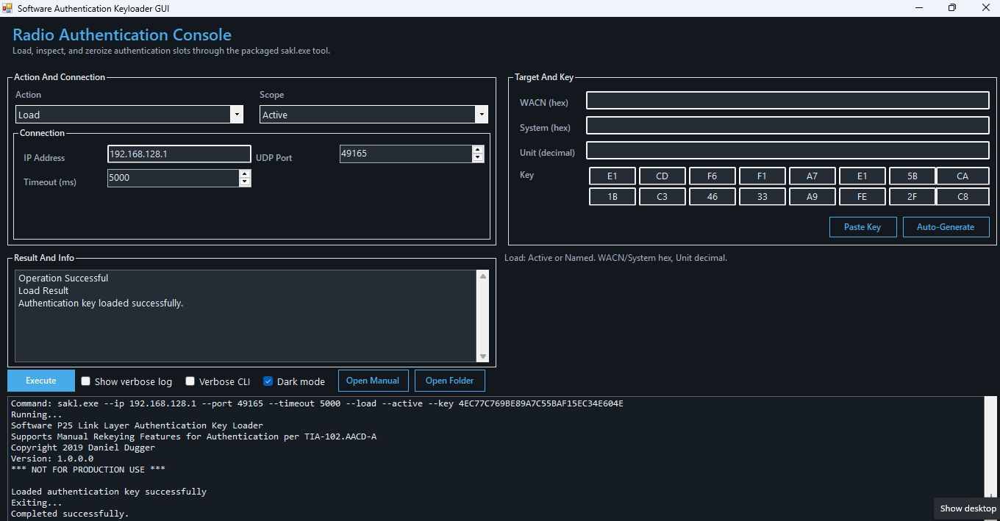

# Software Authentication Keyloader GUI

This is a Windows GUI wrapper for `sakl.exe`.

The goal is simple: make the Software Authentication Key Loader easier to use without having to work from the command line. The packaged release includes the GUI, the original CLI, the manual, and the supporting files needed to run it as a normal desktop app.



## Credit

The original SAKL project, `sakl.exe`, and the bundled documentation are by Daniel Dugger.

Upstream project:
[duggerd/SoftwareAuthKeyLoader](https://github.com/duggerd/SoftwareAuthKeyLoader)

This repository adds the packaged GUI wrapper and the source for that GUI.

## Download

If you just want to use it, grab the latest release from the Releases page:

[Releases](https://github.com/T3011DX/Software-Authentication-Keyloader-GUI/releases)

You do not need to compile anything to use the packaged build.

## What Is Included

- `Software Authentication Keyloader GUI.exe`
- `sakl.exe`
- `sakl.exe.config`
- `sakl_manual.pdf`
- `P25RadioSerialModem.inf`
- GUI source in `src/Launcher/Program.cs`

## Running It

1. Download the release zip.
2. Extract it to a normal folder.
3. Run `Software Authentication Keyloader GUI.exe`.

The GUI uses `sakl.exe` in the same folder, so keep the packaged files together.

## Using The GUI

- `Load` supports `Active` and `Named`
- `Read Status` is intended for `Active`
- `Zeroize` supports `Active`, `Device`, and `Named`

For named operations:

- `WACN` is entered as hex
- `System` is entered as hex
- `Unit` is entered as decimal in the GUI and converted for `sakl.exe`

The key editor is split into 16 byte pairs so it is easier to enter, review, paste, and correct.

## Notes From Testing

- `Read Status -> Active` worked reliably on the tested radio
- `Read Status -> Device` was not reliable and is not offered in the current GUI flow
- `Zeroize` may be rejected by some radios or firmware even when reads work
- `Load` may occasionally need a retry on some radios

## Building From Source

You only need this if you want to modify the GUI or rebuild the launcher.

```powershell
& 'C:\Windows\Microsoft.NET\Framework64\v4.0.30319\csc.exe' /nologo /target:winexe /out:'Software Authentication Keyloader GUI.exe' /r:System.dll /r:System.Drawing.dll /r:System.Windows.Forms.dll '.\src\Launcher\Program.cs'
```

## License

Please keep the bundled `LICENSE` file with the package and preserve attribution to Daniel Dugger as the original SAKL author.
